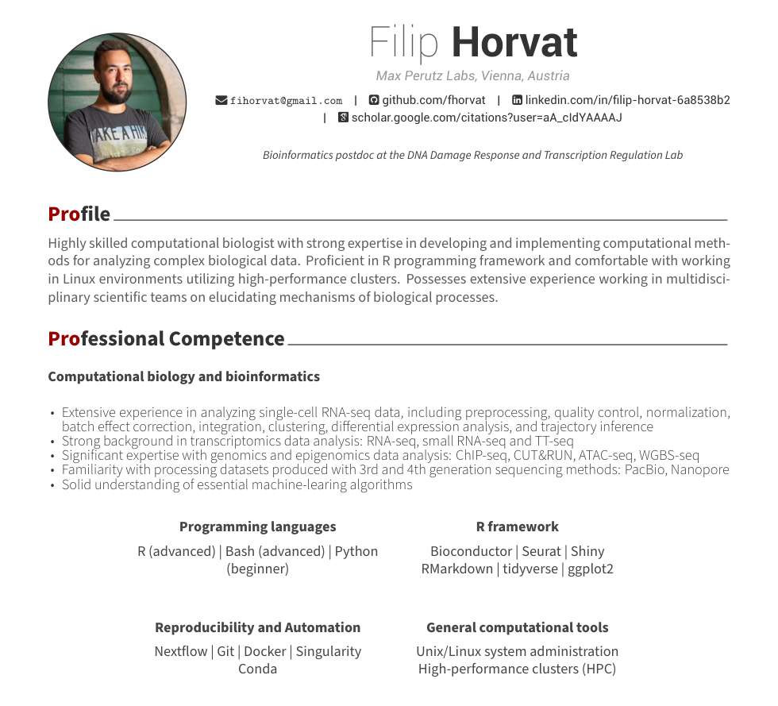

# CV

This repo contains my CV that was built in R using vitae package.

## About

CV was built using [vitae](https://github.com/mitchelloharawild/vitae) package by Mitchell O'Hara-Wild with [HanZhang-psychs](https://github.com/HanZhang-psych/CV) CV and code used a as template.

## Main Files

* `CV.pdf`: Final CV in pdf format.
* `CV.rmd`: The R Markdown code used to create PDF.
* `get_data.R`: Code to get ORCID and Google Scholar data
* `awesome-cv.cls`: This LaTeX template is in charge of the overall style of your CV. [vitae](https://github.com/mitchelloharawild/vitae) supports several templates; this one was tweeked by HanZhang-psychs and further by me to slightly chage font size, color, & spacing. If you prefer the original, delete this file. 
* `apa-cv.csl`: APA 7th style from the [Zotero Style Repository](https://www.zotero.org/styles?q=id%3Aapa-cv). This file defines citation style. Change it to other citation styles if needed.
* `.bib` files: I have 2 `.bib` files that separately store info for publisheded papers and (one) book chapter. This were downloaded from Google Scholar, but can also be exported in your favorite citation manager (Mendeley, Zotero...)
* `lua/strong.lua file`: Used to make my name bold in the publications.  

